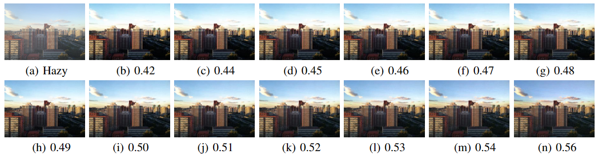
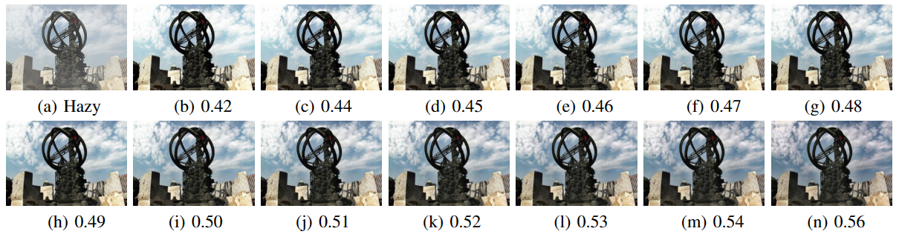
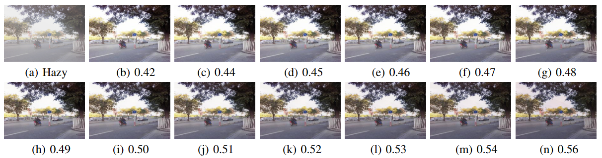
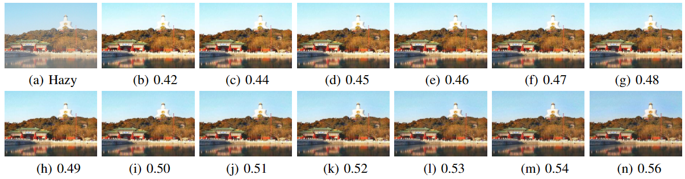

# The document and code for ICDehazing

The code is for the paper, "Illumination Controllable Dehazing Network based on Unsupervised Retinex Embedding".

If you have any suggestions, feel free to contact me (Email: cxf_svip@163.com). Thanks.

Note: I will update this repo after the school server reboot. This is almost the final version of my code. So you can easily use it for your research.

-----------------------------------------------------------

## step 1: prepare dataset
This repo "https://github.com/He-Zhang/image_dehaze/" is easy to read.
It can be used for data generation. 
Or you can choose another repo. 
It is worthy to note that different repos may provide different implements.

The 4KDehazing dataset can be found at "Ultra-High-Definition Image Dehazing via Multi-Guided Bilateral Learning". The repo corresponding to this paper is "https://github.com/zzr-idam/4KDehazing".

-----------------------------------------------------------

## step 2: train

``python train_ICDehazing.py --results_dir ../results/ICDehazing/4KDehazing_L2_DCP --img_w 256 --img_h 256 --train_batch_size 2 --dataset 4KDehazing --rec_loss L2 --prior_per True --prior_per_weight 1 --prior_decay 0.9 --model ICDehazing
``
python train_ICDehazing.py --results_dir ../results/ICDehazing/OTS_L2_DCP --img_w 256 --img_h 256 --train_batch_size 2 --dataset OTS --rec_loss L2 --prior_per True --prior_per_weight 1 --prior_decay 0.9 --model ICDehazing

**note: the val_dataloader (validation data) during training process can be chosen from trainset.
But it should not be chosen from the testset.** 

-----------------------------------------------------------

## step 3: test

python inference_ICDehazing.py --results_dir ../results/ICDehazing/4KDehazing_L2_DCP_val --img_w 256 --img_h 256 --pth_path ../results/ICDehazing/4KDehazing_L2_DCP/models/last_x2y.pth --dataset 4KDehazing --if_mul_alpha False

python inference_ICDehazing.py --results_dir ../results/ICDehazing/OTS_L2_DCP_val --img_w 256 --img_h 256 --pth_path ../results/ICDehazing/OTS_L2_DCP/models/last_x2y.pth --dataset 4KDehazing --if_mul_alpha False

-----------------------------------------------------------
## Some Visual dehazing results with different controllable parameters on SOTS outdoor (trained on OTS)

